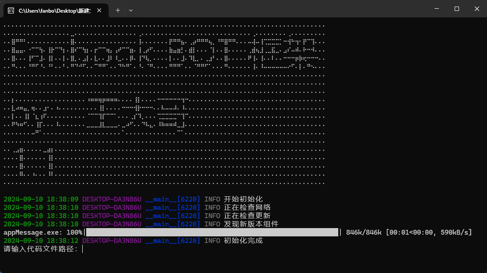

# 框架（便携式环境）使用教程

## 开始使用

下载更新工具：[更新工具](https://124.221.67.43/hj_update.exe)  
将其移动到另一个文件夹里面  
  
<f-alert type="warning">警告：请将更新工具复制到一个空文件夹里面，因为默认会将文件下载到当前目录下</f-alert>  

点击安装
  
完成后点击完成
  

1. 双击main.exe  
  
2. 右键选择记事本打开main.py  
  
3. 将第一行引号里面的内容替换为你的botToken  
  
4. 保存它  
  
5. 程序内输入main.py，然后回车运行  
<f-alert type="danger">运行后，务必将main.py重命名，否则更新后会被覆盖</f-alert>
  
<f-alert type="primary">恭喜你，现在已经成功运行示例程序</f-alert>

## 常见问题

### 缺少.NET组件  

  
出现该问题的解决方法：  
点击Download it now，下载并安装运行库即可

## 编写第一个BOT

> 创建一个.py文件或者编辑main.py，写入以下内容  
<f-alert type="warning">请将第1行的botToken替换为你的机器人的token，第10行中的数字替换为你的机器人的长id</f-alert>

```python
token='bot的token'
def onOpen(ws):
    pass
def onMessage(ws, message):
    global token
    message=json.loads(message)#解析json为字典
    if message["action"] =="push":#如果是推送
        if message["data"]["author"]["bot"] == False:#忽略bot消息
            content = json.loads(message["data"]["content"])#这里获取消息内容
            if "${@!448828939389894656}" in content['text']:#筛选@这个机器人的消息，注意这里的botid改为你机器人的长id
                #我们将逻辑写在这里
                guild_id=message["data"]["guild_id"]#获取消息来源服务器id
                channel_id=message["data"]["channel_id"]#获取消息来源频道id
                text=content['text'][23:]#去掉@以后的内容
                #发送消息
                sendmessage(token,chatid=int(channel_id),type='text',text=text)
            
def onError(ws, error):
    pass
def onClose(ws):
    pass
bot_websocket(token,onOpen,onMessage,onError,onClose)
```

> 如果你的机器人没有发言白名单，可以暂时将第16行替换为：
<f-alert type="danger">用户api仅供学习研究使用，使用造成的后果与作者无关，严禁违法、违规使用，请勿滥用以下代码</f-alert>
```python
send_user_message(bot_token=token,chatid=str(channel_id),type='text',text='{\"type\":\"text\",\"text\":\"'+text+'\",\"contentType\":0}',decs=text,guild_id=str(guild_id))
```  

现在，在主程序填入该程序的路径，然后回车，你@机器人 文本以后，机器人会回应你发出的文本


## 函数列表

> 程序内置fanbookbotapi库，直接写函数名即可，不需要加库名  
[函数列表](https://pypi.org/project/fanbookbotapi/)  
